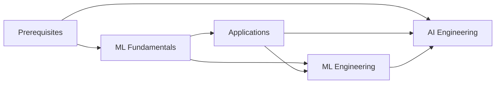

  
  
  
  

# Machine Learning Road Map

Your guide to learning ML and AI fundamentals for free.

## Learning Path

## Topics

| Section | Description |
|---------|-------------|
| [**Prerequisites**](./prerequisites/) | Python, NumPy, Pandas, Math, Git |
| [**ML Fundamentals**](./ml-fundamentals/) | Core ML, Deep Learning, Reinforcement Learning |
| [**Applications**](./applications/) | Computer Vision, NLP, LLMs, Science, Games |
| [**AI Engineering**](./ai-engineering/) | Prompt Engineering, AI Agents, RAG |
| [**ML Engineering**](./ml-engineering/) | Data Engineering, MLOps, Production, Efficiency |

## Getting Started

**Want to understand ML?** Start with [Prerequisites](./prerequisites/), then [ML Fundamentals](./ml-fundamentals/).

**Want to build with AI?** Start with [Prerequisites](./prerequisites/) (just Python), then jump to [AI Engineering](./ai-engineering/).

---

## Interview Prep

- [Cracking the Coding Interview](https://www.amazon.com/Cracking-Coding-Interview-Programming-Questions/dp/0984782850) by Gayle Laakman McDowell
- System Design Interview by Alex Xu - [Volume 1](https://www.amazon.com/System-Design-Interview-insiders-Second/dp/B08CMF2CQF/) and [Volume 2](https://www.amazon.com/System-Design-Interview-Insiders-Guide/dp/1736049119/)
- [Study Plan for ML Interviews](https://github.com/khangich/machine-learning-interview) by Khang Pham

---

**Subscribe to [AI for Software Engineers](https://aiforswes.com/)** for more learning resources.

**Please support the authors and creators of these resources!** Many of these resources had hundreds of hours put into them. If you purchase a book, leave a review. Follow the creators on social media.

---

**Questions or feedback? [Send me a message](https://x.com/loganthorneloe).**
