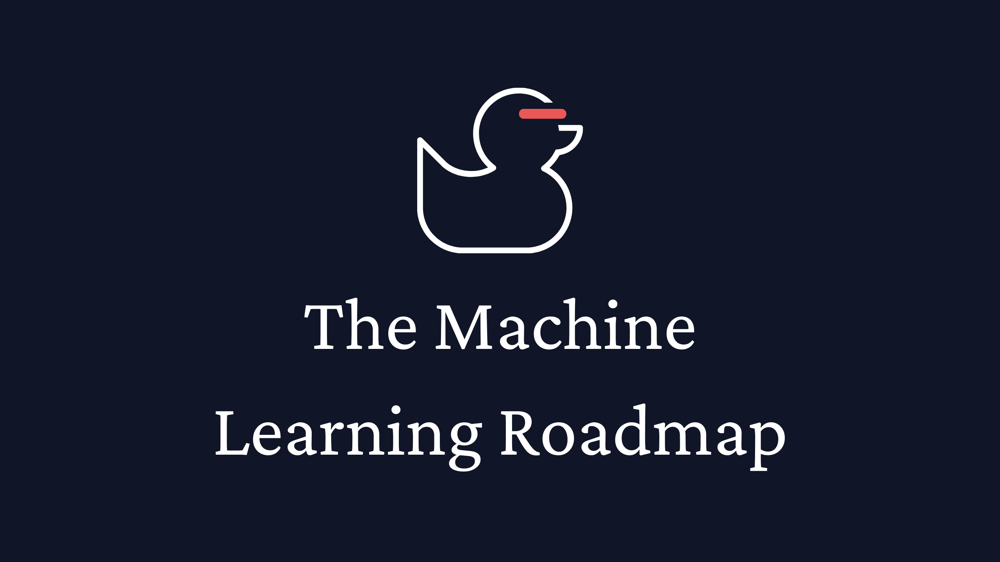

🌟<strong>This guide is free!</strong> Support it (and me!) for free:🌟

  
  
  
  

Welcome to the **Machine Learning Road Map**: Your guide to learning ML fundamentals for free!

This guide will equip you with:

- **Essential ML foundations** - Master the mathematical and programming fundamentals that underpin ML.
- **Core ML concepts** - Understand the key principles and algorithms that drive machine learning.
- **Implementation fundamentals** - Gain the conceptual knowledge needed to start building ML systems.
- **Career preparation** - Know the skills that employers value in ML professionals.

This road map is streamlined and focuses on the most important topics from the best ML educators. The goal is simple: *to get you to a point where you can confidently explore ML topics independently**.

**Before you begin:**

> **Don't forget to subscribe to [AI for Software Engineers](https://aiforswes.com/): The AI newsletter for software engineers.**

> **Please support the authors and creators of these resources!** Many of these resources had hundreds of hours put into them. If you purchase a book linked in the advanced topics section, don't forget to leave a review after reading it! Reviews are vital for authors to continue their work. I've linked to social profiles throughout the document as much as I could. You can support the creators of these resources for free by giving them a follow and liking their content.

Let's go! 🚀

Table of Contents

- [Prerequisites](#prerequisites)
  - [Programming](#programming)
  - [Mathematics](#mathematics)
  - [Development Tools](#development-tools)
- [Advanced Topics](#advanced-topics)
  - [Core Concepts](#core-concepts)
  - [Language Models and NLP](#language-models-and-nlp)
  - [Deep Learning and Transformers](#deep-learning-and-transformers)
  - [Reinforcement Learning](#reinforcement-learning)
  - [Natural Language Processing and Computer Vision](#natural-language-processing-and-computer-vision)
  - [Learning Applications](#learning-applications)
  - [Handling Data](#handling-data)
  - [ML Engineering](#ml-engineering)
  - [Applied AI](#applied-ai)
  - [Other Important Topics](#other-important-topics)
- [Job Skills](#job-skills)
  - [Interview Prep](#interview-prep)
  - [Programming Languages](#programming-languages)
  - [ML Frameworks](#ml-frameworks)
  - [Cloud Platforms](#cloud-platforms)
  - [DevOps Tools](#devops-tools)
- [Free GPUs](#free-gpus)

  

## Prerequisites

### Programming
**General Programming**
- 📚 [CS50 (Intro to Programming and Computer Science)](https://cs50.harvard.edu/x/2024/weeks/0/) by [Harvard](https://www.harvard.edu/)
- 📚 [Google's Python Class](https://developers.google.com/edu/python) by [Google](https://developers.google.com/)
- 📘 [NumPy Tutorial](https://numpy.org/doc/stable/user/quickstart.html) by [NumPy Team](https://numpy.org/teams/)
- 📘 [Pandas Course](https://www.kaggle.com/learn/pandas) by [Kaggle](https://kaggle.com/learn)

### Mathematics
- 📐 [Algebra Curriculum](https://www.khanacademy.org/math/algebra-home) by [Khan Academy](https://www.khanacademy.org/)
- 📐 [Linear Algebra](https://www.khanacademy.org/math/linear-algebra) by [Khan Academy](https://www.khanacademy.org/)
- 📊 [Probability](https://cs50.harvard.edu/ai/2024/weeks/2/) by [Harvard](https://www.harvard.edu/)
- 📈 [Derivatives/Partial Derivatives](https://www.khanacademy.org/math/multivariable-calculus/multivariable-derivatives) by [Khan Academy](https://www.khanacademy.org/)
- 📈 [Gradients](https://www.khanacademy.org/math/multivariable-calculus/multivariable-derivatives/gradient-and-directional-derivatives/v/gradient) by [Khan Academy](https://www.khanacademy.org/)
- 📈 [Backpropagation Visualization](https://developers-dot-devsite-v2-prod.appspot.com/machine-learning/crash-course/backprop-scroll/) by [Google](https://developers.google.com/)

### Development Tools
- 🛠️ [Learn Git](https://git-scm.com/book/en/v2) by [Git Community](https://git-scm.com/)
- 🛠️ [Github Tutorial](https://docs.github.com/en/get-started) by [GitHub](https://github.com/)
- 🛠️ [Learn Shell](https://www.learnshell.org) by [learnshell.org](https://www.learnshell.org)

  

**Core Machine Learning** 
- 📚 [20 Min Introduction to Machine Learning](https://developers.google.com/machine-learning/intro-to-ml) by [Google](https://developers.google.com/)
- 📚 [Machine Learning Crash Course](https://developers.google.com/machine-learning/crash-course) by [Google](https://developers.google.com/)

  

## Advanced Topics

### Core Concepts
- 📘 [Machine Learning Q and AI](https://www.amazon.com/Machine-Learning-AI-Essential-Questions/dp/1718503768/) by [Sebastian Raschka](https://x.com/rasbt)
- 📘 [Designing Machine Learning Systems](https://www.amazon.com/dp/1098107969) by [Chip Huyen](https://x.com/chipro)

### Language Models and NLP
- 🎥 [Intro to LLMs](https://www.youtube.com/watch?v=zjkBMFhNj_g) by [Andrej Karpathy](https://x.com/karpathy)
- 📘 [Build an LLM From Scratch](https://www.amazon.com/Build-Large-Language-Model-Scratch/dp/1633437167/) by [Sebastian Raschka](https://x.com/rasbt)

### Deep Learning and Transformers
- 📚 [Deep Learning Fundamentals](https://lightning.ai/courses/deep-learning-fundamentals/) by [LightningAI](https://lightning.ai)
- 📚 [Engineer's Guide to Deep Learning](https://www.interdb.jp/dl/index.html) by [Hironobu Suzuki](https://x.com/suzuki_hironobu)

### Reinforcement Learning
- 📚 [Spinning Up in RL](https://spinningup.openai.com/en/latest/) by [OpenAI](https://openai.com)

### Natural Language Processing and Computer Vision
- 📚 [NLP Course](https://huggingface.co/learn/nlp-course/chapter1/1) by [Huggingface](https://huggingface.co/learn)
- 📚 [Computer Vision](https://www.kaggle.com/learn/computer-vision) by [Kaggle](https://kaggle.com/learn)

### Learning Applications
- 📘 [ML for Science](https://ml-science-book.com/) by Christoph Molnar & Timo Freiesleben
- 🎮 [ML for Games](https://huggingface.co/learn/ml-games-course/unit0/introduction) by [Huggingface](https://huggingface.co/learn)

### Handling Data
- 📚 [Intro to SQL](https://www.kaggle.com/learn/intro-to-sql) and [Advanced SQL](https://www.kaggle.com/learn/advanced-sql) by [Kaggle](https://kaggle.com/learn)
- 📚 [Data Preparation](https://developers.google.com/machine-learning/data-prep) by [Google](https://developers.google.com/)

### ML Engineering
- 🛠️ [Made with ML](https://madewithml.com/) by [Goku Mohandas](https://x.com/GokuMohandas)
- 🎓 [ML School](https://www.ml.school/) by [Santiago](https://x.com/svpino)

### Applied AI
**AI Agents**
- 📚 [AI Agents in LangGraph](https://www.deeplearning.ai/short-courses/ai-agents-in-langgraph/) by [DeepLearning.AI](https://www.deeplearning.ai/)
- 📚 [Building Agentic RAG with LlamaIndex](https://www.deeplearning.ai/short-courses/building-agentic-rag-with-llamaindex/) by [DeepLearning.AI](https://www.deeplearning.ai/)
- 📘 [LangChain Agents Guide](https://python.langchain.com/docs/concepts/agents/) by [LangChain](https://www.langchain.com/)

**Prompt Engineering**
- 📚 [Prompt Engineering for Developers](https://www.deeplearning.ai/short-courses/chatgpt-prompt-engineering-for-developers/) by [DeepLearning.AI](https://www.deeplearning.ai/)
- 📘 [Prompt Engineering Guide](https://docs.anthropic.com/en/docs/build-with-claude/prompt-engineering/overview) by [Anthropic](https://www.anthropic.com/)
- 📘 [OpenAI Prompt Engineering](https://platform.openai.com/docs/guides/prompt-engineering) by [OpenAI](https://openai.com/)

### Other Important Topics
- 📐 [ML Mathematics](https://www.packtpub.com/en-us/product/mathematics-of-machine-learning-9781837027873) by [Tivadar Danka](https://twitter.com/tivadardanka)
- 📈 [ML Efficiency](https://www.youtube.com/playlist?list=PL80kAHvQbh-pT4lCkDT53zT8DKmhE0idB) by [MIT](https://hanlab.mit.edu/courses/2023-fall-65940)
- 📘 [Knowledge Distillation](https://github.com/dkozlov/awesome-knowledge-distillation) by [Dmitry Kozlov](https://github.com/dkozlov)
- 📚 [AI Ethics](https://www.kaggle.com/learn/intro-to-ai-ethics) by [Kaggle](https://kaggle.com/learn)
- 📚 [ML Explainability](https://www.kaggle.com/learn/machine-learning-explainability) by [Kaggle](https://kaggle.com/learn)

  

## Job Skills

This sections contains popular skills on machine learning-related job listings and resources to prepare for interviews for those jobs.

### Interview Prep
- [Cracking the Coding Interview](https://www.amazon.com/Cracking-Coding-Interview-Programming-Questions/dp/0984782850) by Gayle Laakman McDowell
- 📘 System Design Interview by [Alex Xu](https://twitter.com/alexxubyte)
  - [Volume 1](https://www.amazon.com/System-Design-Interview-insiders-Second/dp/B08CMF2CQF/)
  - [Volume 2](https://www.amazon.com/System-Design-Interview-Insiders-Guide/dp/1736049119/)
- [Study Plan for ML Interviews](https://github.com/khangich/machine-learning-interview) by [Khang Pham](https://x.com/KhangAnPham)

### Programming Languages
- 📚 [Intro to Python](https://cs50.harvard.edu/python/2022/) by Harvard
- 📚 [Python Deep Dive](https://thepythoncodingplace.com/) by [Stephen Gruppetta](https://x.com/s_gruppetta_ct)
- 📚 [C++ Tutorial](https://www.youtube.com/watch?v=vLnPwxZdW4Y) by [freeCodeCamp](https://twitter.com/freeCodeCamp)
- 📘 [Rust](https://doc.rust-lang.org/book/) by Rust Team
- 📚 [Java](https://java-programming.mooc.fi/) by University of Helsinki

### ML Frameworks
**Deep Learning**
- 📚 [TensorFlow 2.0 Complete Course](https://www.youtube.com/watch?v=tPYj3fFJGjk) by [freeCodeCamp](https://twitter.com/freeCodeCamp)
- 📚 [PyTorch for Deep Learning](https://www.youtube.com/watch?v=Z_ikDlimN6A) by [Daniel Bourke](https://twitter.com/mrdbourke)
- 📘 [Scikit-learn Tutorials](https://scikit-learn.org/stable/tutorial/index.html) by Scikit-learn Developers
- 📘 [Keras Tutorial](https://www.tutorialspoint.com/keras/index.htm) by TutorialsPoint

**Data Processing**
- 📘 [NumPy Tutorial](https://numpy.org/doc/stable/user/quickstart.html) by NumPy Team
- 📚 [Pandas Course](https://www.kaggle.com/learn/pandas) by [Kaggle](https://kaggle.com/learn)

**Advanced Tools**
- 🛠️ [JAX Quickstart](https://jax.readthedocs.io/en/latest/notebooks/quickstart.html) by [Google](https://developers.google.com/)
- 🛠️ [ONNX Tutorial](https://github.com/onnx/tutorials) by ONNX Team
- 🛠️ [TensorRT Guide](https://docs.nvidia.com/deeplearning/tensorrt/developer-guide/index.html) by [NVIDIA](https://developer.nvidia.com/)
- 🛠️ [LangChain Crash Course](https://www.youtube.com/watch?v=LbT1yp6quS8) by [Patrick Loeber](https://www.youtube.com/@PatrickLoeber)

**Model Development**
- 📘 [XGBoost Documentation](https://xgboost.readthedocs.io/en/latest/) by XGBoost Team
- 📘 [CUDA Programming Guide](https://docs.nvidia.com/cuda/cuda-c-programming-guide/index.html) by [NVIDIA](https://developer.nvidia.com/)

### Cloud Platforms
**Major Providers**
- 🛠️ [ML on Google Cloud](https://www.coursera.org/specializations/machine-learning-tensorflow-gcp) by [Google Cloud](https://cloud.google.com/)
- 🛠️ [AWS Machine Learning](https://aws.amazon.com/training/learn-about/machine-learning/) by [Amazon Web Services](https://aws.amazon.com/)
- 🛠️ [Azure AI Fundamentals](https://docs.microsoft.com/en-us/learn/certifications/azure-ai-fundamentals/) by [Microsoft](https://www.microsoft.com/en-us/ai)

### DevOps Tools
- 🛠️ [Kubernetes Tutorial](https://www.youtube.com/watch?v=X48VuDVv0do) by [TechWorld with Nana](https://www.youtube.com/@TechWorldwithNana)
- 🛠️ [Docker Tutorial](https://www.youtube.com/watch?v=fqMOX6JJhGo) by [freeCodeCamp](https://twitter.com/freeCodeCamp)

  

## Free GPUs

**Top Choices**
- 🖥️ [Google Colab](https://colab.google/)
  > Free T4/P100 GPUs, limited time
- 🖥️ [Kaggle Notebooks](https://www.kaggle.com/code)
  > 30 hours/week of P100/T4 GPU

**Additional Options**
- 🖥️ [Lightning AI](https://lightning.ai/)
  > 22 GPU hours free
- 🖥️ [Google Cloud Platform](https://cloud.google.com/gpu)
  > $300 free credits
- 🖥️ [Amazon SageMaker](https://aws.amazon.com/machine-learning/accelerate-machine-learning-P3/)
  > Free tier available
- 🖥️ [Paperspace Gradient](https://www.paperspace.com/notebooks)
  > Free community tier
___
___

**If any information is missing, you are the author of a resource and you'd like it removed, or any other general feedback [send me a message](https://x.com/loganthorneloe) to let me know.**
