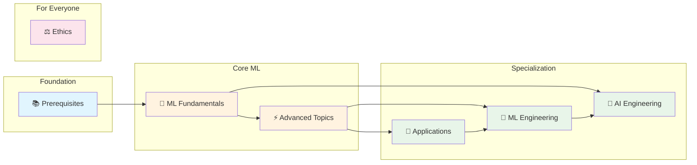

  
  
  
  

# Machine Learning Road Map

Your free guide to learning ML and AI. This roadmap is streamlined—one or two high-quality resources per topic, not a dozen options that leave you paralyzed.

| Section | What You'll Learn |
|---------|-------------------|
| 📚 [**Prerequisites**](./prerequisites/) | Python programming, essential math, and dev tools you need before starting ML |
| 🧠 [**ML Fundamentals**](./ml-fundamentals/) | Core concepts that underpin all of machine learning—how models learn, evaluate, and improve |
| ⚡ [**Advanced Topics**](./advanced-topics/) | Deep learning, reinforcement learning, and other specialized techniques |
| 🎯 [**Applications**](./applications/) | Put ML to work: computer vision, NLP, LLMs, and hands-on projects |
| 🤖 [**AI Engineering**](./ai-engineering/) | Build AI products: prompts, agents, RAG, evals, and benchmarks |
| 🔧 [**ML Engineering**](./ml-engineering/) | Take models to production: data pipelines, MLOps, deployment, and optimization |
| ⚖️ [**Ethics**](./ethics/) | Responsible AI: ethics, explainability, and building systems people can trust |

## 📖 Interview Prep

- 📘 Elements of Programming Interviews in [Python](https://www.amazon.com/Elements-Programming-Interviews-Python-Insiders/dp/1537713949/) / [Java](https://www.amazon.com/Elements-Programming-Interviews-Java-Insiders/dp/1517671272/) / [C++](https://www.amazon.com/Elements-Programming-Interviews-Insiders-Guide/dp/1479274836/)
- 📘 System Design Interview by Alex Xu - [Volume 1](https://www.amazon.com/System-Design-Interview-insiders-Second/dp/B08CMF2CQF/) and [Volume 2](https://www.amazon.com/System-Design-Interview-Insiders-Guide/dp/1736049119/)
- 📋 [Study Plan for ML Interviews](https://github.com/khangich/machine-learning-interview) by Khang Pham

## 🖥️ Free Compute Resources

Need GPUs to train models? These are free:

| Resource | What You Get |
|----------|--------------|
| 🥇 [Google Colab](https://colab.google/) | Free T4/P100 GPUs, easiest to start |
| 🥇 [Kaggle Notebooks](https://www.kaggle.com/code) | 30 hours/week of P100/T4 GPU |
| [Lightning AI](https://lightning.ai/) | 22 GPU hours free |
| [Google Cloud](https://cloud.google.com/gpu) | $300 free credits |
| [Amazon SageMaker](https://aws.amazon.com/machine-learning/accelerate-machine-learning-P3/) | Free tier available |
| [Paperspace Gradient](https://www.paperspace.com/notebooks) | Free community tier |

---

**Subscribe to [AI for Software Engineers](https://aiforswes.com/)** for more resources.

**Support the creators!** Many of these resources took hundreds of hours to make. Buy the books, leave reviews, follow the authors.

**Questions?** [Message me on X](https://x.com/loganthorneloe)
